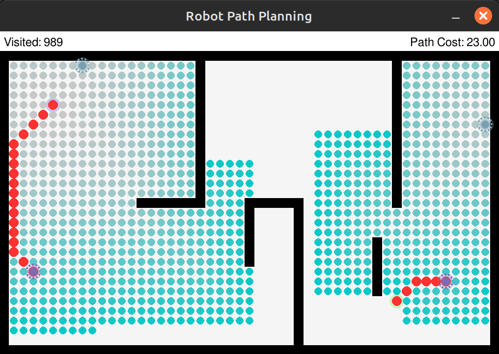

### **Project Overview**  
In this project, we implemented **four search algorithms** and visualized their execution using **PyGame** for better understanding. The algorithms include:  

- **Breadth-First Search (BFS)**  
- **Uniform-Cost Search (UCS)**  
- **Bidirectional Iterative Deepening Search (BI-IDS)**  
- **A\* Search Algorithm**  

For the **A\* algorithm**, we used the **Euclidean distance** as the heuristic function for each node.  

### **Results**  
- **BFS, UCS, and A\*** all guarantee **optimal solutions** for the given problem.  
- Below are visualizations of each algorithm's search process:  
## BSF

## UCS

## BI IDS

## A*

