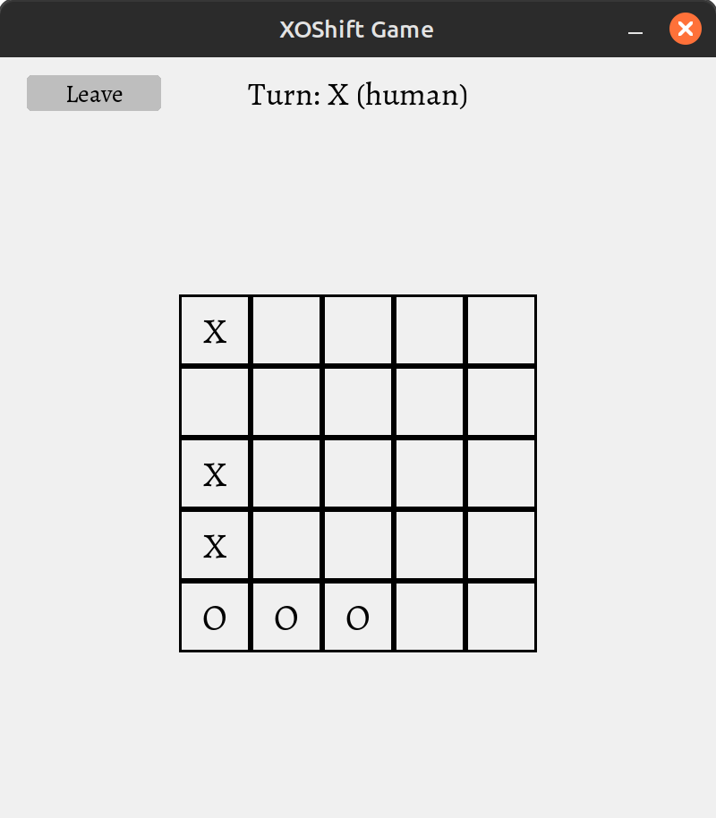
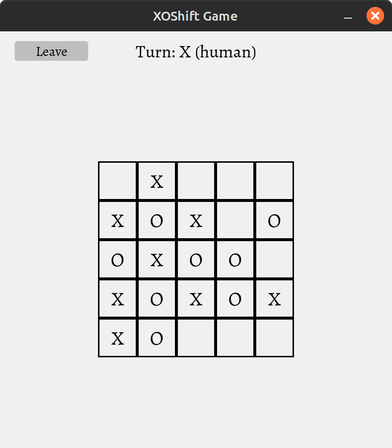
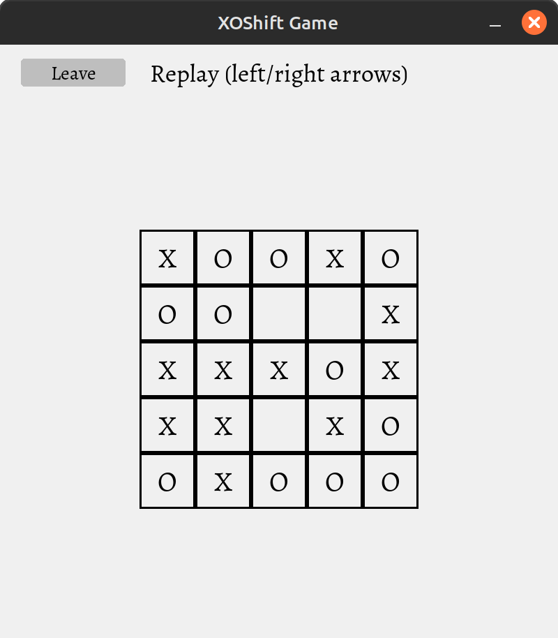
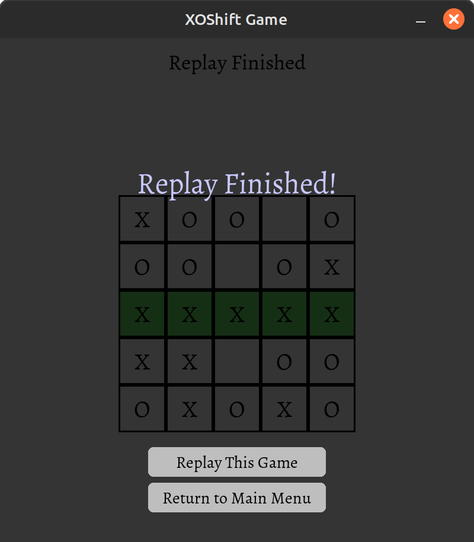

<div align="center">

# 🧠 XOShift Agent


</div>

## 🤖 Agent logic
The core of the agent's logic revolves around the alpha-beta pruning algorithm, a refined version of minimax search that significantly reduces the number of positions evaluated. By limiting the search depth, the agent balances computational speed with strategic foresight. The evaluation function assesses multiple game aspects, such as the longest unbroken line of symbols, control of the center, potential threats, and disruptive moves. On larger boards (5×5 and above), the agent incorporates additional strategic considerations, while on a 3×3 grid, it uses a simplified evaluation for faster computation.

To enhance adaptability, the agent introduces a small element of randomness, preventing predictability in its moves. Early in the game, particularly on a 5×5 board, it may make random moves to avoid being overly deterministic. The agent also prioritizes faster wins and slower losses by adjusting scores based on remaining search depth. This approach ensures that the AI not only plays optimally but also adapts dynamically to different game states.
### step by step logic
1. The agent first identifies all legal moves using get_all_valid_moves(board, player_symbol).This ensures it only considers valid actions based on current board state.
2. On the first 1–2 turns (when moves_played <= 2), the agent plays randomly.This avoids predictable early-game behavior and allows for more varied strategies.
3. For each valid move, the agent simulates the outcome by applying the move and recursively evaluating future game states. It explores up to a certain depth (`MAX_DEPTH`) into the game tree. Uses alpha-beta pruning to skip exploring unpromising branches — improving performance without losing strategic strength.
4. When the search reaches the end of its depth or encounters a terminal state (win/loss), it evaluates the board using a custom scoring function.
5. After evaluating all possible moves, the agent picks the one with the highest score. Adds some randomness so it doesn’t always pick the same move when multiple options have similar scores.

## 🧮 Agent Implementation 

The agent is implemented using an **alpha-beta pruning algorithm** with depth-limited search to efficiently evaluate possible moves while balancing performance and strategic depth. It dynamically selects between two evaluation functions—a simplified version for 3×3 boards and a more comprehensive one for larger grids—that assess key game aspects such as unbroken symbol lines, center control, threats, and disruptive opportunities. The agent incorporates a small random chance to select suboptimal moves (1% probability) to avoid predictability, and it makes random moves in the early stages of larger (5×5+) games to ensure varied openings. By using efficient board copying methods (`fast_copy_board`) and terminating searches early when wins or losses are detected, the agent optimizes computational resources while maintaining strong gameplay. The implementation supports flexible adjustments to search depth and evaluation weights, allowing for fine-tuned performance across different game variants and difficulty levels.

## 📊 Heuristic Evaluation Functions

Since full game trees are too big to explore completely, especially for larger boards like 5x5, the agent uses **heuristic functions** to estimate the value of a board position.

### 1. `evaluate(board, player_symbol)` – Full Feature Scoring

This function combines several metrics to assess how favorable a board is for the agent:

| Metric | Description |
|--------|-------------|
| **Max Contiguous Line** | Rewards long unbroken lines of the agent's symbol |
| **Threats** | Detects nearly completed winning lines (1 empty cell left) |
| **Center Control** | Rewards placing symbols near the center of the board |
| **Forks** | Identifies positions that create multiple threats at once |
| **Disruption** | Penalizes opponent opportunities to form lines |

Each metric is weighted to reflect its importance,also put a bigger weight for opponent metrics by multiply by 3 and this weights computed by testing some combinations of weights and choose the best one:
The strategy is not to lose the game first, and after that plan to win the game
```python
weights = {
    'max_line': 30,
    'threat': 100,
    'center': 2,
    'fork': 20,
    'disrupt': 5
}

return weights['max_line'] * (max_contiguous(board, player_symbol) - 3*max_contiguous(board, opponent)) +
        weights['threat'] * (threats - 3*threatso) +
        weights['center'] * (center_density(board, player_symbol) - center_density(board, opponent)) +
        weights['fork'] * (forks - 3*forkso) +
        weights['disrupt'] * (disruption - disruptiono)


```

### 2. `evaluate3(board, player_symbol)` – Simplified for 3x3 Boards

Used specifically for small boards. It only compares the longest contiguous line of the player and opponent.

- Less computationally intensive
- Sufficient for small board games.

## 🎯 Move Selection Strategy

After computing the scores for all possible moves, the agent selects the best one with this logic:

```python
if score > best_score or (r == 1 and score > -10):
    best_score = score
    best_move = move
```

- Picks the move with the highest score
- Occasionally introduces randomness (`r == 1`) to avoid deterministic patterns and (`score > -10`) to avoid agent takes stupid decision.

---

# 📈 Results

The agent was tested using the [w.py](w.py) script, which simulates games between agents by randomly choosing player symbols and returning match results.

## Against Random Agent

The result of the agent against a random agent is:
```
Your agent scored 100.00% points
```

## Against Basic Agent

The result of the agent against a basic agent with `Max depth` 2, is:
```
Your agent scored 93.33% points
```

## Against Deep Agent

The result of the agent against a deeper-searching agent with `Max depth` 4 is:
```
Your agent scored 86.67% points
```

# Shots





